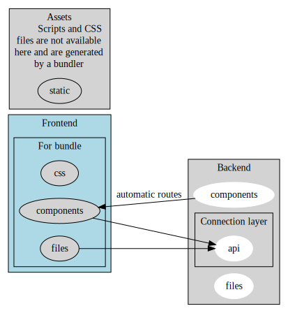

# 🚀 **Faster + React**

## 🌟 Introduction

`faster_react` is a framework that performs **Server-Side Rendering (SSR)** and
**hydration** of all React components, and generates routes for them. To utilize
this, you must use the routes helper provided by the framework
([React Router](#-react-router)). The framework's configuration file is located
at `options.json`.

### 🎯 **What Does `faster_react` Do for You?**

Focus solely on development! This framework handles:

- 🛣️ **Automatic route generation** for React components.
- 🔄 **Automatic inclusion** of new React components when
  `framework => "dev": true`.
- 📦 **Automatic frontend bundling** when `framework => "dev": true`.
- ♻️ **Automatic browser reload** when `framework => "dev": true`.
- 🗜️ **Automatic frontend minification** when `framework => "dev": false`.
- 🚀 **Automatic backend reload** when changes are detected and
  `framework => "dev": true`.
- 🌐 **Automatic detection** of Deno Deploy environment. Test in other
  serverless environments by setting `framework => "serverless": true`.

> **Note:** The project includes a simple application example demonstrating each
> functionality.

---

### ⚡ **About Faster**

Faster is an optimized middleware server with an incredibly small codebase (~300
lines), built on top of Deno's native HTTP APIs with no dependencies. It
includes a collection of useful middlewares:

- 📄 **Log file**
- 🗂️ **Serve static**
- 🌐 **CORS**
- 🔐 **Session**
- ⏱️ **Rate limit**
- 🛡️ **Token**
- 📥 **Body parsers**
- 🔀 **Redirect**
- 🔌 **Proxy**
- 📤 **Handle upload**

Fully compatible with Deno Deploy. Examples of all resources are available in
the [README](https://github.com/hviana/faster). Faster's ideology is simple: all
you need is an optimized middleware manager; all other functionality is
middleware.

---

## 📚 **Contents**

- [⚡ Benchmarks](#-benchmarks)
- [🏗️ Architecture](#%EF%B8%8F-architecture)
- [📂 App Structure](#-app-structure)
  - [📦 Get Deno Kv and Deno Kv Fs](#-get-deno-kv-and-deno-kv-fs)
  - [📝 Backend API](#-backend-api)
  - [🧩 Backend Components](#-backend-components)
  - [📁 Backend Files](#-backend-files)
  - [🖥️ Frontend Components](#%EF%B8%8F-frontend-components)
  - [🎨 Frontend CSS](#-frontend-css)
  - [📜 Frontend Files](#-frontend-files)
  - [🗂️ Static](#%EF%B8%8F-static)
- [🧭 React Router](#-react-router)
- [📦 Packages Included](#-packages-included)
- [🛠️ Creating a Project](#%EF%B8%8F-creating-a-project)
- [🚀 Running a Project](#-running-a-project)
- [🌐 Deploy](#-deploy)
- [📖 References](#-references)
- [👨‍💻 About](#-about)

---

## ⚡ **Benchmarks**

`faster_react` has only **0.9%** of the code quantity of Deno Fresh.

**Benchmark Command:**

```bash
# Deno Fresh
git clone https://github.com/denoland/fresh.git
cd fresh
git ls-files | xargs wc -l
# Output: 104132 (version 1.7.1)

# faster_react
git clone https://github.com/azuresphere7/faster_react.git
cd faster_react
git ls-files | xargs wc -l
# Output: 1037 (version 13.6)
```

---

## 🏗️ **Architecture**

This framework utilizes **Headless Architecture** [[1]](#1) to build the
application, combined with the **Middleware Design Pattern** [[2]](#2) for
defining API routes in the backend.

- **Headless Architecture** provides complete freedom to the developer, reducing
  the learning curve. Despite this freedom, there is an **explicit separation
  between backend and frontend**, which aids in development.
- The **Middleware Design Pattern** offers a practical and straightforward
  method for defining API routes.



---

## 📂 **App Structure**

All application folders are inside the `app` folder.

### 📦 **Get Deno Kv and Deno Kv Fs**

On the backend, if a **Deno KV** instance is available, access instances via
`Server.kv` and `Server.kvFs`:

```typescript
import { Server } from "faster";
```

See **Deno KV** settings in `options.json`.

- **Deno KV File System (`Server.kvFs`):** Compatible with Deno Deploy. Saves
  files in 64KB chunks. Organize files into directories, control the KB/s rate
  for saving and reading files, impose rate limits, set user space limits, and
  limit concurrent operations—useful for controlling uploads/downloads. Utilizes
  the Web Streams API.

More details: [deno_kv_fs](https://github.com/hviana/deno_kv_fs)

> **Note:** The project includes a simple application example demonstrating each
> functionality.

---

### 📝 **Backend API**

- **Imports:** Import your backend libraries here.
- **Organization:** Files can be organized into subdirectories.
- **File Extension:** Use `.ts` files.
- **Structure:** Flexible file and folder structure that doesn't influence
  anything.
- **Routing:** Define routes using any pattern you prefer.
- **Exports:** Must have a `default export` with a function (can be
  asynchronous).
- **Function Input:** Receives an instance of `Server` from `faster`.
- **Usage:** Perform backend manipulations here (e.g., fetching data from a
  database), including asynchronous calls.
- **Routes:** Define your custom API routes. For help, see:
  [faster](https://github.com/hviana/faster)

---

### 🧩 **Backend Components**

- **Optionality:** A backend component is optional for a frontend component.
- **Imports:** Import your backend libraries here.
- **Organization:** Organize files into subdirectories.
- **File Extension:** Use `.ts` files.
- **Correspondence:** Each file should have the same folder structure and name
  as the corresponding frontend component but with a `.ts` extension.

  - **Example:**
    - Frontend: `frontend/components/checkout/cart.tsx`
    - Backend: `backend/components/checkout/cart.ts`

- **Exports:** Must have a `default export` with an object of type
  `BackendComponent`:

  ```typescript
  import { type BackendComponent } from "@helpers/backend/types.ts";
  ```

- **Usage:** Intercept a frontend component request:
  - **Before Processing (`before?: RouteFn[]`):** List of middleware functions
    (see: [faster](https://github.com/hviana/faster)). Use to check headers
    (`ctx.req.headers`) or search params (`ctx.url.searchParams`), like tokens,
    impose rate limits, etc.

    - **Note:** To cancel page processing, do not call `await next()` at the end
      of a middleware function.
    - **Important:** If you want the page to be processed, **do not** consume
      the `body` of `ctx.req`, or it will cause an error in the framework.

  - **After Processing
    (`after?: (props: Record<any, any>) => void | Promise<void>`):** Function
    receives the `props` that will be passed to the component. Add backend data
    to these `props`, such as data from a database. Can be asynchronous.

---

### 📁 **Backend Files**

- **Imports:** Import your backend libraries here.
- **Organization:** Organize files into subdirectories.
- **File Extension:** Use `.ts` files.
- **Usage:** Free to make exports or calls (including asynchronous).
- **Purpose:** Group common functions/objects for `backend/api`,
  `backend/components`, and other `backend/files`, such as user validations.

---

### 🖥️ **Frontend Components**

- **Imports:** Use only frontend libraries.
- **Organization:** Organize files into subdirectories.
- **File Extension:** Use `.tsx` files.
- **Rendering:** Rendered on the server and hydrated on the client.
- **Routes Generated:** Two routes per file:
  - **Page Route:** For rendering as a page, e.g., `/pages/checkout/cart`.
  - **Component Route:** For rendering as a component, e.g.,
    `/components/checkout/cart`.
- **Initial Route (`/`):** Points to `frontend/components/index.tsx`.
- **Exports:** Must have a `default export` with the React Function/Component.
- **Props Passed to Component:**
  - Form-submitted data (or JSON POST).
  - URL search parameters (e.g., `/pages/myPage?a=1&b=2` results in
    `{a:1, b:2}`).
  - Manipulations from `backend/components`.

---

### 🎨 **Frontend CSS**

Application CSS style files.

- **Multiple Files:** Automatically compiled.
- **Organization:** Organize files into subdirectories.

---

### 📜 **Frontend Files**

- **Imports:** Use only frontend libraries.
- **Organization:** Organize files into subdirectories.
- **File Extensions:** Use `.ts` and `.js` files.
- **Usage:** Free to make exports or calls (including asynchronous).
- **Difference from Components:** Scripts are not automatically delivered to the
  client. They need to be imported by the `frontend/components`.
- **Purpose:** Group common functions/objects for React Functions/Components,
  like form field validations. Can have `frontend/files` common to other
  `frontend/files`.

---

### 🗂️ **Static**

Files served statically. Routes are generated based on the folder and file
structure.

- **Example:** `localhost:8080/static/favicon.ico` matches `static/favicon.ico`.

---

## 🧭 **React Router**

Since the framework has its own routing system, a third-party routing library is
unnecessary. Use the framework helper:

```typescript
import { getJSON, route } from "@helpers/frontend/route.ts";
```

### **Interface Parameters:**

```typescript
interface Route {
  headers?: Record<string, string>; // When routing to a page, headers are encoded in the URL. Intercept them in ctx.url.searchParams in a backend/components file.
  content?:
    | Record<any, any>
    | (() => Record<any, any> | Promise<Record<any, any>>);
  path: string;
  startLoad?: () => void | Promise<void>;
  endLoad?: () => void | Promise<void>;
  onError?: (e: Error) => void | Promise<void>;
  elSelector?: string; // Required for component routes.
  method?: string; // Only for API routes. Optional; defaults to GET or POST.
}
```

### **Examples**

**Navigating to a Page with Search Params:**

```jsx
// URL search params passed as properties to the page. Props receive `{a:1}`
<button onClick={route({ path: "/pages/test?a=1" })}>
  Go to Test Page
</button>;
```

**Passing Additional Parameters:**

```jsx
// Props receive `{a:1, example:"exampleStr"}`
<button
  onClick={route({
    path: "/pages/test?a=1",
    content: { example: "exampleStr" },
  })}
>
  Go to Test Page with Extra Data
</button>;
```

**Using Asynchronous Content:**

```jsx
// Props receive `{a:1, ...JSONResponse}`
<button
  onClick={route({
    path: "/pages/test?a=1",
    content: async () => {
      return await getJSON({
        path: "/example/json",
        content: {
          test: "testData",
        },
      });
    },
  })}
>
  Go to Test Page with Async Data
</button>;
```

**Programmatic Routing:**

```typescript
(async () => {
  if (user.loggedIn) {
    await route({
      path: "/pages/dash",
      content: { userId: user.id, token: token },
    })();
  } else {
    await route({ path: "/pages/users/login" })();
  }
})();
```

**Loading a Component:**

```jsx
<button
  onClick={route({
    path: "/components/Counter",
    elSelector: "#myAnotherCounter",
  })}
>
  Load Counter Component
</button>;
```

**Making an API Call:**

```jsx
<button
  onClick={async () => {
    const res = await getJSON({
      path: "/example/json",
      content: {
        test: "testData",
      },
    });
    console.log(res);
    alert(JSON.stringify(res));
  }}
>
  Fetch JSON Data
</button>;
```

---

## 📦 **Packages Included**

Several packages are included to assist in developing React applications. Here
are some examples of imports you can use without additional configuration:

```typescript
import {/* your imports */} from "react";
import {/* your imports */} from "react/";
import {/* your imports */} from "react-dom";
import {/* your imports */} from "react-dom/server";
import {/* your imports */} from "react-dom/client";
import {/* your imports */} from "react/jsx-runtime";
import {/* your imports */} from "render";
import {/* your imports */} from "htm/react";
import {/* your imports */} from "@helpers/frontend/route.ts";
import {/* your imports */} from "@helpers/backend/types.ts";

// **About Faster:**
// Faster is an optimized middleware server with an incredibly small codebase (~300 lines), built on top of Deno's native HTTP APIs with no dependencies. It includes useful middlewares: log file, serve static, CORS, session, rate limit, token, body parsers, redirect, proxy, and handle upload. Fully compatible with Deno Deploy. Examples are available in the README. Faster's ideology: all you need is an optimized middleware manager; all other functionality is middleware. See more at: https://deno.land/x/faster

import {/* your imports */} from "faster";

import { options, server } from "@core"; // Useful for accessing the server instance.
```

---

## 🛠️ **Creating a Project**

You can simply download this repository. Alternatively, use the command
(requires `git` installed and configured):

```bash
deno run -A -r "https://deno.land/x/faster_react/new.ts" myProjectFolder
```

Customize and configure the server in `options.json`.

---

## 🚀 **Running a Project**

Execute the command:

```bash
deno task serve
```

---

## 🌐 **Deploy**

- **Install Deployctl:**

  ```bash
  deno install -A --global jsr:@deno/deployctl
  ```

- **Deploy Your Project:**

  ```bash
  deployctl deploy
  ```

- **Note:** For production, set `framework => "dev": false` in `options.json`.

---

## 📖 **References**

<a id="1">[1]</a> Dragana Markovic, Milic Scekic, Alessio Bucaioni, and Antonio
Cicchetti. 2022. _Could Jamstack Be the Future of Web Applications Architecture?
An Empirical Study._ In _Proceedings of the 37th ACM/SIGAPP Symposium on Applied
Computing_ (SAC '22). Association for Computing Machinery, New York, NY, USA,
1872–1881. DOI:
[10.1145/3477314.3506991](https://doi.org/10.1145/3477314.3506991)

<a id="2">[2]</a> Brown, Ethan. _Web Development with Node and Express:
Leveraging the JavaScript Stack_. O'Reilly Media, 2019. URL:
[http://www.oreilly.com/catalog/9781492053484](http://www.oreilly.com/catalog/9781492053484)
